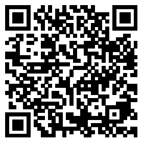
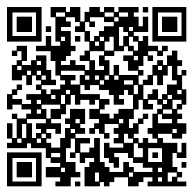

# demo
>项目如其名，就是各种demo，作为平时学习的积攒

下面是具体介绍

blablablablablablabla～～～(*&^&*&%$%*&%%%*$&*#*)

blablablablablablablablablablablablablabla～～～～(此处应有掌声)

blablablablablablablablaaaaa～～～～

blablablablablablablablablablabbbb～～～～

blablablablablablablablablablablablablablablablablablablablabla～～～～ \_(:3」∠)\_完全不知道在说些什么，好吧介绍不重要！

这个demo里具体有：

* 字体投影 [点我](http://wyicwx.github.io/demo/dist/shadow/)

* ios滑动解锁 [点我](http://wyicwx.github.io/demo/dist/sliding-effect/)

* 动态流星雨 [点我](http://wyicwx.github.io/demo/dist/meteor/)



* 翻页&&色相旋转的渐变背景 [点我](http://wyicwx.github.io/demo/dist/turn/)



<style type="text/css">
	img {width: 80px;height: 80px;}
</style>
**PS**: 以上效果大部分纯css3和js实现，请用webkit内核的浏览器打开，二维码请用ios设备，不能保证其他设备的兼容性

##### 如果要调试的话

```shell
$ npm install ./
$ bone connect
```

访问 http://localhost:8081/dist

**LICENSE**: 这么莫名其妙的项目竟然还有 [MIT](/LICENSE) 