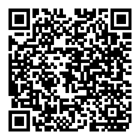

这个项目是平时工作生活之余所见所感记录之用
=

+ 视觉相关
	1. 按钮状态切换
+ 交互相关
	1. 输入框异常提示
	2. 登录框
	3. 
+ 开发相关
	1. less函数库
	2. css通用类global

这个demo里具体有：

* 字体投影 [点我](http://wyicwx.github.io/demo/dist/shadow/)

* ios滑动解锁 [点我](http://wyicwx.github.io/demo/dist/sliding-effect/)



* 动态流星雨 [点我](http://wyicwx.github.io/demo/dist/meteor/)


* 翻页&&色相旋转的渐变背景 [点我](http://wyicwx.github.io/demo/dist/turn/)


**PS**: 以上效果大部分纯css3和js实现，请用webkit内核的浏览器打开，二维码请用ios设备，不能保证其他设备的兼容性

##### 如果要调试的话，请在clone源码后分别执行下面的代码

```shell
$ npm install ./
$ bone connect
```

访问 http://localhost:8081/dist

**LICENSE**: 这么莫名其妙的项目竟然还有 [MIT](/LICENSE) 

**Donate**: 如果你觉得这个项目对你有帮助的话，可以点[这里](/Donate.md)